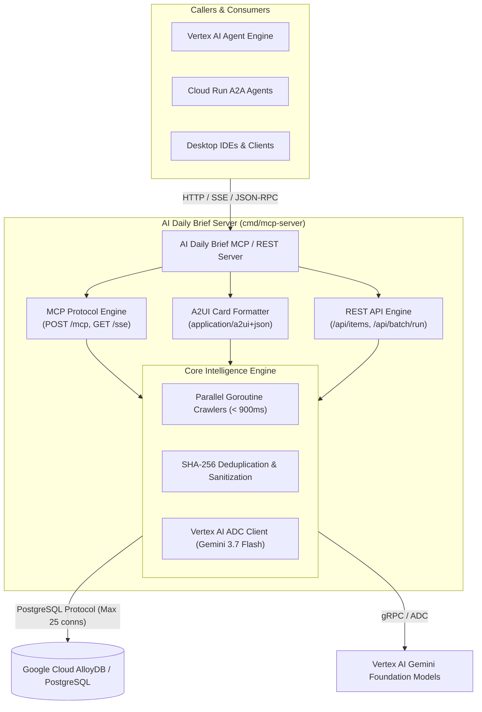

# ⚡ AI Daily Brief

> **Cloud-Native Model Context Protocol (MCP) & REST Control Plane Server** powered by Go, Gin, GORM, Google Cloud AlloyDB for PostgreSQL, and Google Vertex AI.

---

## 🎯 What is AI Daily Brief?

**AI Daily Brief** is an enterprise-grade agentic control plane and intelligence aggregation engine designed to run as a **Google Cloud Run** service. It continuously indexes, dedup Lion-hashes, and synthesizes 5 core streams of artificial intelligence and cloud computing developments:

1. 🔵 **Frontier Models**: Google (Gemini 3.7 / 2.5), Anthropic (Claude), OpenAI (GPT-5 / o3 / Sora), X AI (Grok), Meta AI.
2. ☁️ **Google Cloud & Compute**: Official release notes, Vertex AI managed infrastructure, AI Hypercomputer, TPUs, GKE.
3. 🟣 **AI Research Papers**: Multi-category arXiv API (`cs.CL`, `cs.AI`, `cs.CV`, `cs.LG`), Hugging Face Daily Papers, and academic benchmarks.
4. 🟢 **AI Business & Infrastructure**: Venture capital funding rounds, hyperscale datacenter buildouts, hardware supply chains.
5. 🟠 **Open-Source & Tooling**: Open weights (DeepSeek, Llama, Qwen, Mistral), local inference runtimes (vLLM, Ollama), fine-tuning harnesses.

---

## 🏗️ Core Architecture at a Glance

---

## 📚 Documentation Sections

Explore the comprehensive guides below:

- **[Getting Started](/docs/getting-started/)**: Quickstart, running locally with Bazel, and environment profile configuration.
- **[Architecture](/docs/architecture/)**: In-depth design of the parallel crawler engine, hashing deduplication, and control plane.
- **[Model Context Protocol (MCP)](/docs/mcp-server/)**: Complete tool definitions, JSON Schema specifications, and **A2UI** interactive card outputs.
- **[Cloud Run Deployment](/docs/cloud-run/)**: Building container images, configuring Cloud Run probes, and IAM service-to-service security.
- **[Google Cloud AlloyDB](/docs/alloydb/)**: Setting up AlloyDB for PostgreSQL, connection pooling, and profile management (`.env.test.toml` vs `.env.integration.toml`).
- **[Agent-to-Agent (A2A) Service](/docs/a2a-agent/)**: Autonomous Cloud Run agent service consuming the MCP control plane with Google ADK / Gemini workflows.
- **[Gemini Enterprise Integration](/docs/gemini_enterprise/)**: Complete guide for registering the A2A Agent & MCP Server into Gemini Enterprise / Discovery Engine Agent Registry.
- **[REST API Reference](/docs/rest-api/)**: Complete endpoint reference for items, crawls, settings, and multimodal live streaming.
- **[Troubleshooting Guide](/docs/troubleshooting/)**: Comprehensive debugging workflows, AlloyDB auth proxy local tunnels, and IAM troubleshooting.
