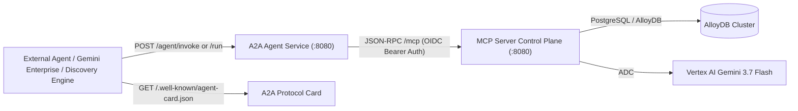

# 🤖 Agent-to-Agent (A2A) Service & Agent Card

The **A2A Agent** (`cmd/a2a-agent`) is an autonomous AI agent service deployable to **Google Cloud Run** that consumes the **AI Daily Brief MCP Server** as its intelligent control plane.

---

## 🎯 Architecture



---

## 📋 Google Agent Registry A2A Agent Card Specification

The A2A Agent serves the official [Google Agent Registry Schema](https://docs.cloud.google.com/agent-registry/json-schemas) containing top-level `url`, `protocolVersion`, `defaultInputModes`, `defaultOutputModes`, `skills`, and `capabilities`.

The card is available across all canonical paths:
- `GET /a2a/app/.well-known/agent-card.json`
- `GET /.well-known/agent-card.json`
- `GET /.well-known/agent.json`
- `GET /agent-card.json`
- `GET /agent-card`

### Agent Card JSON Schema:
```json
{
  "name": "ai-daily-brief-a2a-agent",
  "description": "Autonomous AI intelligence agent providing deep research, structured synthesis, executive TL;DR briefings, and live grounding across frontier AI models, academic research papers, open-source tooling, and Google Cloud infrastructure releases backed by the AI Daily Brief MCP control plane.",
  "version": "1.0.0",
  "protocolVersion": "1.0.0",
  "url": "https://ai-daily-brief-agent-dev-${PROJECT_NUMBER}.us-central1.run.app",
  "defaultInputModes": [
    "text/plain"
  ],
  "defaultOutputModes": [
    "text/plain",
    "application/a2ui+json"
  ],
  "skills": [
    {
      "id": "research_topic",
      "name": "Research AI Topic",
      "description": "Perform deep research on a specific AI model, research paper, or cloud infrastructure topic",
      "tags": [
        "research",
        "grounding",
        "search"
      ],
      "examples": [
        "Perform deep research on Gemini 3.7 reasoning capabilities",
        "Search latest research papers on multimodal mixture-of-experts"
      ]
    },
    {
      "id": "generate_tldr",
      "name": "Generate Strategic TLDR",
      "description": "Generate an executive 3-section strategic intelligence summary of today's key developments",
      "tags": [
        "summary",
        "executive",
        "briefing"
      ],
      "examples": [
        "Generate today's executive intelligence summary",
        "Summarize key AI infrastructure developments for today"
      ]
    },
    {
      "id": "trigger_crawl",
      "name": "Trigger Live Intelligence Crawl",
      "description": "Execute an immediate live crawl across all 5 intelligence streams into AlloyDB",
      "tags": [
        "crawler",
        "ingestion",
        "refresh"
      ],
      "examples": [
        "Trigger an immediate live crawl of AI feeds",
        "Refresh feeds from arXiv, blogs, and official releases"
      ]
    },
    {
      "id": "chat",
      "name": "Interactive Grounded Research Chat",
      "description": "Interactive multi-turn research grounded in today's digest or specific articles",
      "tags": [
        "chat",
        "dialogue",
        "grounding"
      ],
      "examples": [
        "Tell me more about the architecture behind Gemini 3.7",
        "Compare recent frontier model releases"
      ]
    }
  ],
  "capabilities": {
    "streaming": true
  }
}
```

---

## 📡 API Endpoints

### 1. `POST /agent/invoke` or `POST /run`
Executes an autonomous research task using the MCP control plane.

**Request:**
```json
{
  "task": "Find latest Gemini 3.7 papers and generate a briefing"
}
```

---

### 2. `POST /chat`
Interactive conversational research grounded against the MCP server.

**Request:**
```json
{
  "message": "Summarize key features of Gemini 3.7 Flash reasoning capabilities",
  "session_id": "session_a2a_01"
}
```

---

### 3. `GET /healthz` & `GET /status`
Readiness/liveness probes and runtime status showing MCP server connectivity and model settings.

---

## 🚀 Publishing to Gemini Enterprise & Agent Registry

```bash
agents-cli publish gemini-enterprise \
  --agent-card-url https://ai-daily-brief-agent-dev-${PROJECT_NUMBER}.us-central1.run.app/a2a/app/.well-known/agent-card.json \
  --gemini-enterprise-app-id projects/${PROJECT_NUMBER}/locations/global/collections/default_collection/engines/ai-daily-brief
```

> [!TIP]
> For the complete step-by-step IAM permissions setup (`roles/run.invoker` for Discovery Engine), organization policy overrides, and interactive Google Cloud Console workflows, see the dedicated [Gemini Enterprise Integration Guide](/docs/gemini_enterprise/).
