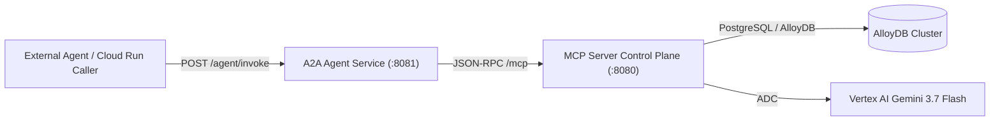

# 🤖 Agent-to-Agent (A2A) Service

The **A2A Agent** (`cmd/a2a-agent`) is an autonomous AI agent service deployable to **Google Cloud Run** that consumes the **AI Daily Brief MCP Server** as its intelligent control plane.

---

## 🎯 Architecture



---

## 🚀 Running the A2A Agent Locally

The agent uses configuration rooted in `configs/agent/`:

```bash
# Run A2A Agent on port 8081 (automatically loads configs/agent/.env.toml)
bazel run //:run-agent

# Or run with integration profile:
ENV=integration bazel run //:run-agent
```

---

## 📡 Endpoints

### 1. `POST /agent/invoke` or `POST /run`
Executes an autonomous research task using the MCP control plane.

**Request Payload:**
```json
{
  "task": "Find the latest research papers and benchmarks on Gemini 3.7 and generate a briefing"
}
```

**Response Payload:**
```json
{
  "success": true,
  "result": {
    "task_name": "Find the latest research papers...",
    "status": "SUCCESS",
    "tool_calls": ["list_articles", "get_article_context", "generate_tldr"],
    "output": "### 🤖 Agent Execution Report: ai-daily-brief-a2a-agent\n\n...",
    "duration_ms": 1420
  }
}
```

---

### 2. `POST /chat`
Interactive conversational research grounded against the MCP server.

**Request Payload:**
```json
{
  "message": "Summarize the key differences between Gemini 3.7 Flash and 2.5 Flash",
  "session_id": "session_a2a_01"
}
```

---

### 3. `GET /healthz`
Cloud Run readiness & liveness probe returning agent health and MCP server connection telemetry.
