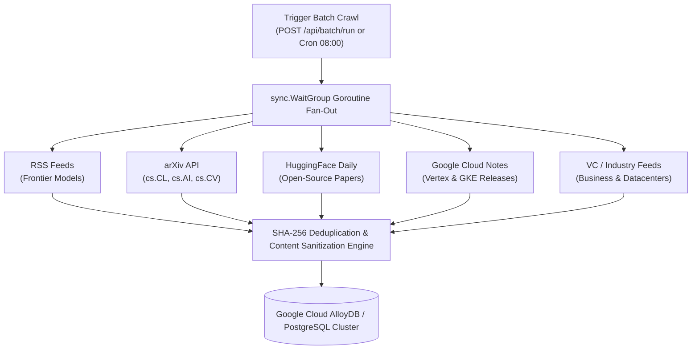

# 🏛️ Architecture & System Design

AI Daily Brief is designed around high concurrency, sub-second latency, and clean separation between data ingestion, agent control planes, and storage engines.

---

## 1. High-Performance Parallel Crawling Engine

The crawler (`internal/crawler`) uses concurrent Go goroutines with `sync.WaitGroup` to dispatch scrapers simultaneously across all configured sources:

- **Execution Latency**: Typically **< 900ms** to scrape, parse, sanitize, and insert 20–40 new items.
- **Deduplication**: Every article's unique canonical URL is indexed. Pre-existing records are skipped in memory and database transaction boundaries.

---

## 2. Dynamic Grounding & Context Extraction

When an agent requests context for an article (`get_article_context` or `agent_chat`), the agent engine invokes `agent.FetchFullArticleText(url)`:
- Downloads live HTML via an optimized HTTP client with custom user-agents.
- Uses `goquery` to strip boilerplate (scripts, ads, navigation bars, cookie banners, tracking iframes).
- Extracts clean textual content and truncates safely within the LLM context window.

---

## 3. Dual Protocol Plane (MCP & REST)

The unified server exposes two interface models concurrently:
1. **Model Context Protocol (MCP)**: JSON-RPC 2.0 and Server-Sent Events (SSE) streaming for agent callers (Vertex AI Agent Engine, Cloud Run agents, Antigravity).
2. **REST API**: HTTP endpoints (`/api/items`, `/api/batch/run`, `/api/agent/tldr`, `/ws/live`) for webhooks, microservices, and client applications.
