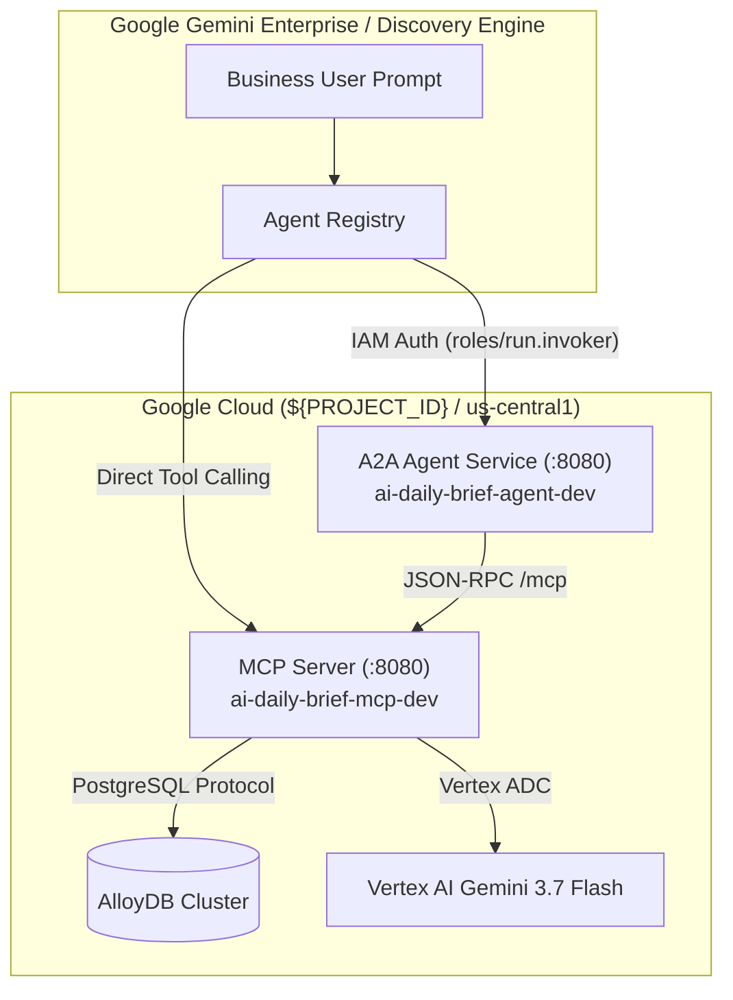

# 🌐 Google Gemini Enterprise Integration Guide

This guide walks through configuring, deploying, securing, and integrating **AI Daily Brief** into **Google Gemini Enterprise** (Google Cloud Agent Registry / Discovery Engine).

AI Daily Brief supports dual integration modes:
1. **Agent-to-Agent (A2A) Protocol**: Connects the autonomous conversational agent (`ai-daily-brief-agent`) to Gemini Enterprise via standard Google Agent Cards (`.well-known/agent-card.json`).
2. **Model Context Protocol (MCP) Connector**: Directly binds the MCP tool control plane (`ai-daily-brief-mcp`) into Discovery Engine as a managed tool connector.

---

## 🏗 Architecture Overview



---

## 📌 Environment Setup & Variables

Before executing registration and IAM binding commands, export your environment variables:

```bash
export PROJECT_ID="YOUR_PROJECT_ID"
export PROJECT_NUMBER="YOUR_PROJECT_NUMBER"
export REGION="us-central1"
export ENVIRONMENT="dev"

# Derived system identity for Discovery Engine / Gemini Enterprise
export DISCOVERY_ENGINE_SA="service-${PROJECT_NUMBER}@gcp-sa-discoveryengine.iam.gserviceaccount.com"
```

---

## 🛡️ Step 1: Organization Policy Configuration (Optional)

If your Google Cloud Organization restricts custom MCP connectors in Discovery Engine, apply the organization policy override:

```yaml
# deployments/mcp/disable-mcp-constraint.yaml
name: projects/${PROJECT_NUMBER}/policies/discoveryengine.managed.disableCustomMcpServerConnector
spec:
  rules:
  - enforce: false
```

Apply the policy via `gcloud`:
```bash
gcloud org-policies set-policy deployments/mcp/disable-mcp-constraint.yaml \
  --project="${PROJECT_ID}"
```

---

## 🔐 Step 2: Granting Cloud Run Invoker Permissions

Gemini Enterprise communicates with private Cloud Run services using the Discovery Engine managed service account identity (`service-${PROJECT_NUMBER}@gcp-sa-discoveryengine.iam.gserviceaccount.com`). You must grant `roles/run.invoker` on both the A2A Agent service and the MCP Server service.

### 1. Grant Invoker Role on A2A Agent Service

```bash
gcloud run services add-iam-policy-binding ai-daily-brief-agent-dev \
    --region=us-central1 \
    --project="${PROJECT_ID}" \
    --member="serviceAccount:service-${PROJECT_NUMBER}@gcp-sa-discoveryengine.iam.gserviceaccount.com" \
    --role="roles/run.invoker"
```

**Expected Command Output:**
```text
Updated IAM policy for service [ai-daily-brief-agent-dev].
bindings:
- members:
  - serviceAccount:ai-daily-brief-agent-sa-dev@${PROJECT_ID}.iam.gserviceaccount.com
  - serviceAccount:service-${PROJECT_NUMBER}@gcp-sa-discoveryengine.iam.gserviceaccount.com
  - user:YOUR_EMAIL
  role: roles/run.invoker
etag: BwZaNBUbtwo=
version: 1
```

### 2. Grant Invoker Role on MCP Server Service

```bash
gcloud run services add-iam-policy-binding ai-daily-brief-mcp-dev \
    --region=us-central1 \
    --project="${PROJECT_ID}" \
    --member="serviceAccount:service-${PROJECT_NUMBER}@gcp-sa-discoveryengine.iam.gserviceaccount.com" \
    --role="roles/run.invoker"
```

**Expected Command Output:**
```text
Updated IAM policy for service [ai-daily-brief-mcp-dev].
bindings:
- members:
  - serviceAccount:ai-daily-brief-sa-dev@${PROJECT_ID}.iam.gserviceaccount.com
  - serviceAccount:service-${PROJECT_NUMBER}@gcp-sa-discoveryengine.iam.gserviceaccount.com
  - user:YOUR_EMAIL
  role: roles/run.invoker
etag: BwZaNBXyt1a=
version: 1
```

---

## 📋 Step 3: Agent Card Definition & Compliance

The A2A Agent serves the compliant Google Agent Registry specification directly from the following canonical endpoints:
- `https://ai-daily-brief-agent-dev-${PROJECT_NUMBER}.${REGION}.run.app/.well-known/agent-card.json`
- `https://ai-daily-brief-agent-dev-${PROJECT_NUMBER}.${REGION}.run.app/a2a/app/.well-known/agent-card.json`

### Agent Card JSON Payload
```json
{
  "name": "ai-daily-brief-a2a-agent",
  "description": "Autonomous AI intelligence agent providing deep research, structured synthesis, executive TL;DR briefings, and live grounding across frontier AI models, academic research papers, open-source tooling, and Google Cloud infrastructure releases backed by the AI Daily Brief MCP control plane.",
  "version": "1.0.0",
  "protocolVersion": "1.0.0",
  "url": "https://ai-daily-brief-agent-dev-${PROJECT_NUMBER}.us-central1.run.app",
  "defaultInputModes": [
    "text/plain"
  ],
  "defaultOutputModes": [
    "text/plain",
    "application/a2ui+json"
  ],
  "skills": [
    {
      "id": "research_topic",
      "name": "Research AI Topic",
      "description": "Perform deep research on a specific AI model, research paper, or cloud infrastructure topic",
      "tags": [
        "research",
        "grounding",
        "search"
      ],
      "examples": [
        "Perform deep research on Gemini 3.7 reasoning capabilities",
        "Search latest research papers on multimodal mixture-of-experts"
      ]
    },
    {
      "id": "generate_tldr",
      "name": "Generate Strategic TLDR",
      "description": "Generate an executive 3-section strategic intelligence summary of today's key developments",
      "tags": [
        "summary",
        "executive",
        "briefing"
      ],
      "examples": [
        "Generate today's executive intelligence summary",
        "Summarize key AI infrastructure developments for today"
      ]
    },
    {
      "id": "trigger_crawl",
      "name": "Trigger Live Intelligence Crawl",
      "description": "Execute an immediate live crawl across all 5 intelligence streams into AlloyDB",
      "tags": [
        "crawler",
        "ingestion",
        "refresh"
      ],
      "examples": [
        "Trigger an immediate live crawl of AI feeds",
        "Refresh feeds from arXiv, blogs, and official releases"
      ]
    },
    {
      "id": "chat",
      "name": "Interactive Grounded Research Chat",
      "description": "Interactive multi-turn research grounded in today's digest or specific articles",
      "tags": [
        "chat",
        "dialogue",
        "grounding"
      ],
      "examples": [
        "Tell me more about the architecture behind Gemini 3.7",
        "Compare recent frontier model releases"
      ]
    }
  "capabilities": {
    "streaming": true,
    "extensions": [
      {
        "uri": "https://a2ui.org/a2a-extension/a2ui/v0.9",
        "description": "Provides agent driven UI using the A2UI JSON format.",
        "params": {
          "acceptsInlineCatalogs": true,
          "supportedCatalogIds": [
            "https://a2ui.org/specification/v0_9/material_catalog.json",
            "https://www.gstatic.com/vertexaisearch/a2ui/v0_9/gemini_enterprise_composite_catalog.json",
            "https://a2ui.org/specification/v0_9/basic_catalog.json"
          ]
        }
      }
    ]
  }
}
```

---

## 🔗 Step 4: Registering in Gemini Enterprise / Agent Registry

### Method A: Automated CLI Registration (`google-agents-cli`)

Publish programmatically using `google-agents-cli`:

```bash
agents-cli publish gemini-enterprise \
  --agent-card-url "https://ai-daily-brief-agent-dev-${PROJECT_NUMBER}.${REGION}.run.app/.well-known/agent-card.json" \
  --gemini-enterprise-app-id "projects/${PROJECT_NUMBER}/locations/global/collections/default_collection/engines/ai-daily-brief"
```

---

### Method B: Google Cloud Console (Interactive UI)

1. Open **Google Cloud Console** &rarr; **Gemini Enterprise** &rarr; **Agent Registry** (or **Discovery Engine** &rarr; **Agents**).
2. Click **Register Agent** and select **Agent-to-Agent (A2A)**.
3. In **Agent Card URL**, enter:
   ```text
   https://ai-daily-brief-agent-dev-${PROJECT_NUMBER}.us-central1.run.app/.well-known/agent-card.json
   ```
4. Click **Fetch Details** (the console automatically parses the skills and capabilities from the card).
5. On the **Additional details (OAuth / Scopes)** step:
   - Select **Skip & Finish** (since authentication is managed natively via Google Cloud IAM `roles/run.invoker`).

---

## 🧪 Step 5: Verification & Diagnostics

### 1. Verify Agent Card Endpoint
```bash
curl -s -H "Authorization: Bearer $(gcloud auth print-identity-token)" \
  "https://ai-daily-brief-agent-dev-${PROJECT_NUMBER}.${REGION}.run.app/.well-known/agent-card.json" | jq .
```

### 2. Test Autonomous Invocation via Cloud Run
```bash
curl -X POST \
  -H "Authorization: Bearer $(gcloud auth print-identity-token)" \
  -H "Content-Type: application/json" \
  -d '{"task": "Find latest Gemini 3.7 papers and generate a briefing"}' \
  "https://ai-daily-brief-agent-dev-${PROJECT_NUMBER}.${REGION}.run.app/agent/invoke" | jq .
```

### 3. Test Direct MCP Tool Execution
```bash
ENDPOINT="https://ai-daily-brief-mcp-dev-${PROJECT_NUMBER}.${REGION}.run.app"
ACCESS_TOKEN=$(gcloud auth print-access-token)

# Generate an audience-bound ID token
TOKEN=$(curl -s -X POST \
  -H "Authorization: Bearer $ACCESS_TOKEN" \
  -H "Content-Type: application/json" \
  -d "{\"audience\": \"${ENDPOINT}\", \"includeEmail\": true}" \
  "https://iamcredentials.googleapis.com/v1/projects/-/serviceAccounts/ai-daily-brief-sa-dev@${PROJECT_ID}.iam.gserviceaccount.com:generateIdToken" | jq -r .token)

# List available tools
curl -s -X POST -H "Authorization: Bearer $TOKEN" \
  -H "Content-Type: application/json" \
  -d '{"jsonrpc": "2.0", "method": "tools/list", "id": 1}' \
  "${ENDPOINT}/mcp" | jq .
```
